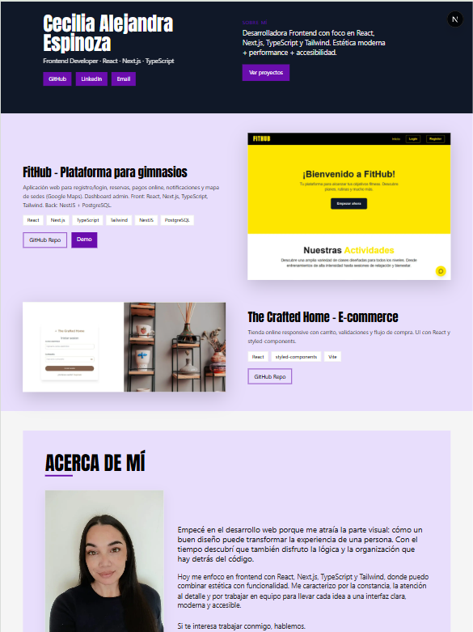

 🌐 Portfolio - Cecilia Alejandra Espinoza

Bienvenido a mi portfolio personal, un espacio donde muestro mis proyectos, habilidades y experiencia como **Frontend Developer**.  
Construido con tecnologías modernas para transmitir mi estilo y marca personal.

## 🚀 Tecnologías utilizadas
- [Next.js](https://nextjs.org/) 15
- [React](https://react.dev/) 18
- [TypeScript](https://www.typescriptlang.org/)
- [Tailwind CSS](https://tailwindcss.com/)

## ✨ Características
- Diseño responsive y moderno 📱💻
- Secciones de **Proyectos, Tecnologías, Sobre mí y Contacto**
- Integración con **GitHub, LinkedIn y Email**
- Despliegue en **Vercel**

## 📸 Vista previa
  

## 📂 Estructura del proyecto
src/
├── app/ # Páginas principales con Next.js
├── components/ # Componentes reutilizables (Header, About, Projects, Contact, etc.)
├── data/ # Datos de proyectos y skills
└── public/images/ # Imágenes de los proyectos

## 🔗 Enlaces
- 🌍 [Demo en Vercel](https://portfolio.vercel.app)  
- 💼 [LinkedIn](https://www.linkedin.com/in/alejandraespinoza405/)  
- 🐙 [GitHub](https://github.com/Alejandraespinoza405)  

## 📧 Contacto
Si te interesa colaborar o ver más de mi trabajo, podés escribirme a:  
**alejandra2025espinoza@gmail.com**

---

👩‍💻 Desarrollado por **Cecilia Alejandra Espinoza** | Frontend Developer

This is a [Next.js](https://nextjs.org) project bootstrapped with [`create-next-app`](https://nextjs.org/docs/app/api-reference/cli/create-next-app).

## Getting Started

First, run the development server:

```bash
npm run dev
# or
yarn dev
# or
pnpm dev
# or
bun dev
```

Open [http://localhost:3000](http://localhost:3000) with your browser to see the result.

You can start editing the page by modifying `app/page.tsx`. The page auto-updates as you edit the file.

This project uses [`next/font`](https://nextjs.org/docs/app/building-your-application/optimizing/fonts) to automatically optimize and load [Geist](https://vercel.com/font), a new font family for Vercel.

## Learn More

To learn more about Next.js, take a look at the following resources:

- [Next.js Documentation](https://nextjs.org/docs) - learn about Next.js features and API.
- [Learn Next.js](https://nextjs.org/learn) - an interactive Next.js tutorial.

You can check out [the Next.js GitHub repository](https://github.com/vercel/next.js) - your feedback and contributions are welcome!

## Deploy on Vercel

The easiest way to deploy your Next.js app is to use the [Vercel Platform](https://vercel.com/new?utm_medium=default-template&filter=next.js&utm_source=create-next-app&utm_campaign=create-next-app-readme) from the creators of Next.js.

Check out our [Next.js deployment documentation](https://nextjs.org/docs/app/building-your-application/deploying) for more details.
